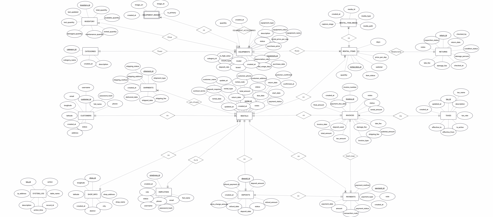

Equipment Management System

Hệ thống quản lý thiết bị trên Oracle Database Quản lý kho, đơn thuê, trả thiết bị, tính phí trễ hạn và xuất hóa đơn — phần lớn xử lý ở tầng database bằng PL/SQL.

   
  
Mục lục
Giới thiệu
Nghiệp vụ hệ thống xử lý
Thiết kế database
Công nghệ sử dụng
Phạm vi đồ án
 
Giới thiệu

Hệ thống xử lý toàn bộ vòng đời của một đơn thuê thiết bị: từ quản lý kho, tạo đơn thuê, trả thiết bị, tính phí trễ hạn, đến thanh toán và xuất hóa đơn có thuế.

Mục tiêu chính của đồ án là thực hành thiết kế CSDL quan hệ và lập trình PL/SQL cho một bài toán nghiệp vụ có nhiều ràng buộc: một thiết bị không thể vừa cho thuê vừa sẵn có, tiền cọc phải khớp giá trị thiết bị, phí trễ hạn phải tính tự động theo số ngày trễ. Phần lớn các quy tắc này được đẩy xuống tầng database bằng trigger và procedure thay vì xử lý ở tầng ứng dụng.

 
Nghiệp vụ hệ thống xử lý
<table> <tr> <td width="50%" valign="top">

Quản lý thiết bị & kho Theo dõi thiết bị theo danh mục, số lượng tồn, và trạng thái hiện tại (sẵn có / đang thuê / bảo trì).

Quản lý đơn thuê Tạo đơn thuê, gán thiết bị vào đơn, ghi nhận tiền cọc. Trạng thái thiết bị cập nhật tự động khi đơn được xác nhận.

Xử lý trả thiết bị Ghi nhận ngày trả thực tế, tự động tính phí trễ hạn nếu vượt thời hạn thuê, đánh giá tình trạng thiết bị sau khi trả để quyết định mức hoàn cọc.

</td> <td width="50%" valign="top">

Thanh toán & hóa đơn Tổng hợp tiền thuê, phí phát sinh, thuế để xuất hóa đơn cho từng đơn thuê.

Ghi log & kiểm soát Lưu vết các thao tác quan trọng (tạo đơn, thay đổi trạng thái thiết bị, thanh toán) phục vụ kiểm tra khi có sai lệch dữ liệu.

</td> </tr> </table>  
Thiết kế database

Các quy tắc nghiệp vụ được implement chủ yếu ở tầng database:

Đối tượng	Vai trò
Trigger	Cập nhật trạng thái thiết bị mỗi khi đơn thuê được tạo hoặc thiết bị được trả
Function	Tính phí trễ hạn dựa trên số ngày vượt hạn và đơn giá thiết bị
Procedure	Xử lý luồng tạo hóa đơn: tổng hợp tiền thuê + phí phát sinh, áp thuế, ghi vào bảng hóa đơn
Constraint	Đảm bảo một thiết bị không thể xuất hiện ở hai đơn thuê đang hoạt động cùng lúc

 
<b>Lược đồ CSDL (ERD)</b> — bấm để xem
   Chèn ảnh ERD của bạn vào đây, ví dụ:
markdown

  
Công nghệ sử dụng
Thành phần	Công nghệ
Database	Oracle Database
Ngôn ngữ	SQL, PL/SQL
Logic nghiệp vụ	Stored Procedures, Functions, Triggers
Thiết kế	Lược đồ quan hệ (ERD), chuẩn hóa đến 3NF
 
Phạm vi đồ án

Đây là đồ án tập trung vào backend database hơn là giao diện — trọng tâm là thiết kế lược đồ đúng ràng buộc nghiệp vụ và viết PL/SQL để các quy tắc (tính phí, cập nhật trạng thái, xuất hóa đơn) chạy được ngay ở tầng CSDL, không phụ thuộc tầng ứng dụng phía trên.

Made by <a href="https://github.com/TuyetAnh0101">TuyetAnh0101</a>

